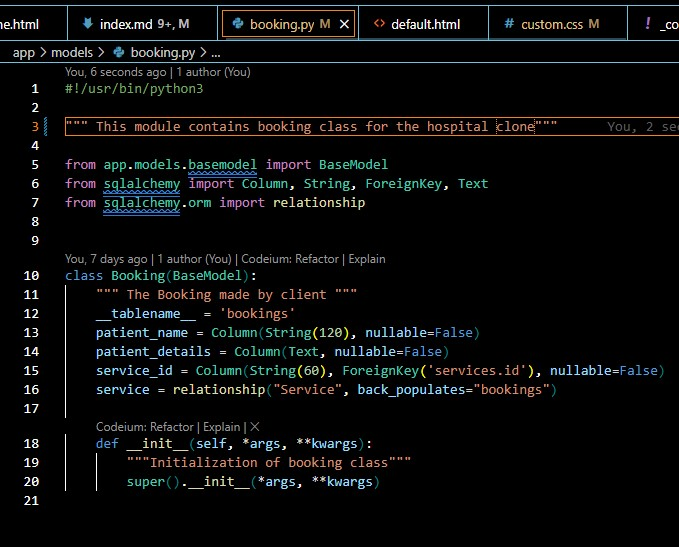
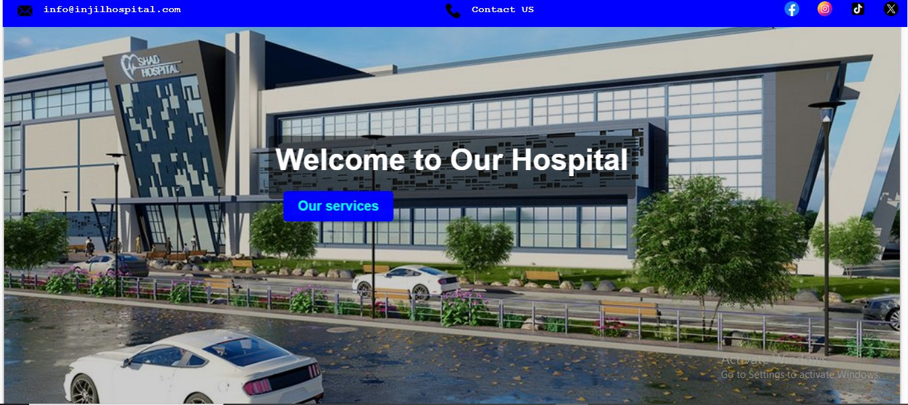
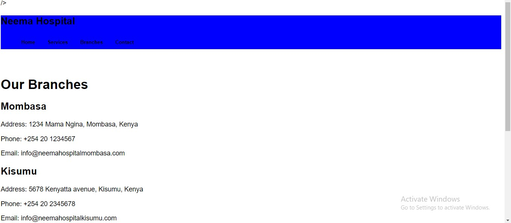

<!-- Navigation Bar -->
<nav class="nav-bar">
  <a href="#about">About</a>
  <a href="#overview">Overview</a>
  <a href="#learn-more">Learn More</a>
</nav>

<!-- Cover Image Section -->

  <h1>Hospital Web Clone</h1>
  
Efficient hospital service management made easy.

  <a href="#learn-more" class="button">Learn More</a>

<!-- Key Features Section -->
## Key Features

  

    
    <h2>Bookings</h2>
    
Effortlessly schedule and manage medical appointments with our intuitive booking system. Patients can easily choose available slots and receive instant confirmations.

  

  

    
    <h2>Services</h2>
    
Access a comprehensive list of hospital services, including specialty consultations and routine check-ups. Our platform allows seamless integration with hospital service offerings.

  

  

    
    <h2>Records</h2>
    
Manage and review patient records efficiently. Our system provides secure access to patient history, test results, and other critical information to streamline hospital operations.

  

<!-- About Section -->
## About the Developer

My name is Francis Waihiga, a developer focusing on building scalable and efficient web applications. I designed this project to help streamline hospital services and improve healthcare management.

<!-- Project Overview Section -->
## Project Overview

This web clone offers services like:

- Booking medical appointments
- Managing patient information
- Administrative hospital services

<!-- About Section -->
## About the Project

The **Hospital Web Clone** project was inspired by my personal experience with healthcare systems. After encountering inefficiencies in managing appointments and patient records during a family health crisis, I realized how technology could significantly improve the quality and efficiency of healthcare services. This project aims to address these challenges by creating a comprehensive web application for managing hospital services.

This project was developed as part of my portfolio for Holberton School. It represents a significant step in my journey as a developer, combining my interest in technology with a meaningful application that can have a real-world impact.

### Team Members

- **Francis Waihiga**
  - [LinkedIn](https://www.linkedin.com/in/francis-waihiga-476198209/)
  - [GitHub](https://github.com/FrancKenya)
  - [Twitter](https://x.com/blueinjil)

### GitHub Repository

- [Hospital Web Clone GitHub Repository](https://github.com/FrancKenya/Hospital_web_Clone1)

<!-- Learn More Section -->
## Learn More

<a href="https://astonishing-gingersnap-390921.netlify.app/" class="button button-green">View Deployed App</a>

- [GitHub Repo](https://github.com/FrancKenya/Hospital_web_Clone1)
- [Deployed App](https://astonishing-gingersnap-390921.netlify.app/)
